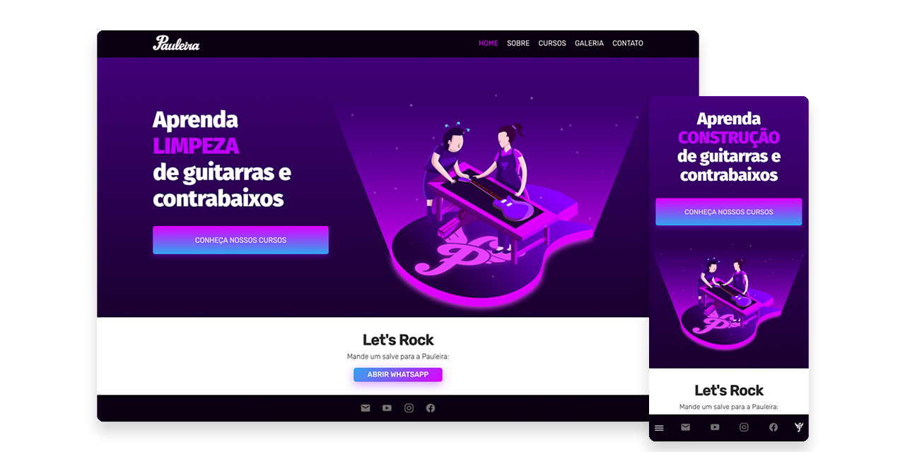

# Pauleira Front Web

This is a website bootstraped with [Create React App](https://github.com/facebook/create-react-app) and It's part of a initial project made for Pauleira Guitars, that I'm building together with a backend in NodeJs and a Front End Admin.

The idea is to create a strong base for escalating and add features in the future.

## How to run

For now you can run this project as stand alone SPA, this way (note: I use Yarn for packaging but feel free to run with NPM as well):

- Clone it from this repo.
- Run `yarn install`.
- Run `yarn dev` and it should run in dev mod in port `3000`.
- Run `yarn build && yarn start` to create build folder and run on port `5000`.

## Contact Info

I'm a front end developer mainly, and sometimes I can put myself in risc by acting as fullstack developer with React & NodeJs. I'm also a designer as well, and you can contact me by email: [montone@gmail.com](mailto:montone@gmail.com).
